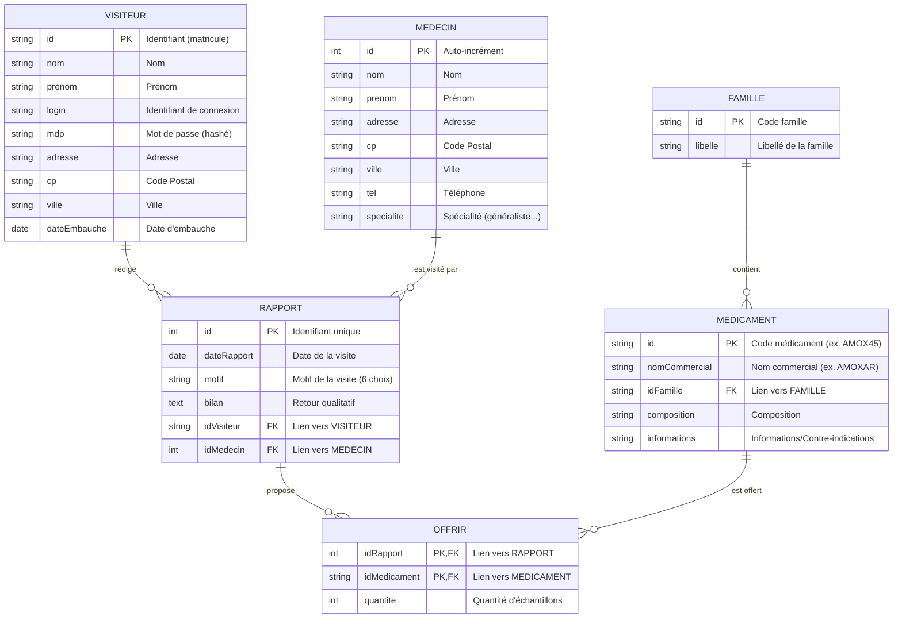

# Database Relational Schema - Projet GSB

Ce document définit la structure de la base de données MySQL pour l'application GSB. Vous pouvez copier ce code Mermaid et l'importer dans **Draw.io** ou tout visualiseur Mermaid.

## Diagramme ERD (Modèle Physique de Données)

---

## 📋 Détails des Tables

1.  **VISITEUR** : Stocke les informations des visiteurs médicaux (authentification et données personnelles).
2.  **MEDECIN** : Gère les informations des praticiens (cibles des visites).
3.  **FAMILLE** : Catégorise les médicaments (ex: Antibiotiques, Antalgiques).
4.  **MEDICAMENT** : Référentiel des produits pharmaceutiques.
5.  **RAPPORT** : Table pivot du projet, consigne les détails de chaque visite effectuée par un visiteur chez un médecin.
6.  **OFFRIR** : Table d'association entre un rapport et un médicament pour tracer les échantillons (quantité offerte).

---

## 🔑 Contraintes d'Intégrité
- **Clés Primaires (PK)** : Identifiants uniques pour chaque table.
- **Clés Étrangères (FK)** : Assurent la cohérence des relations entre les visites, les médecins, les visiteurs et les médicaments.
- **Table d'association (OFFRIR)** : Utilise une clé primaire composite (idRapport + idMedicament).
